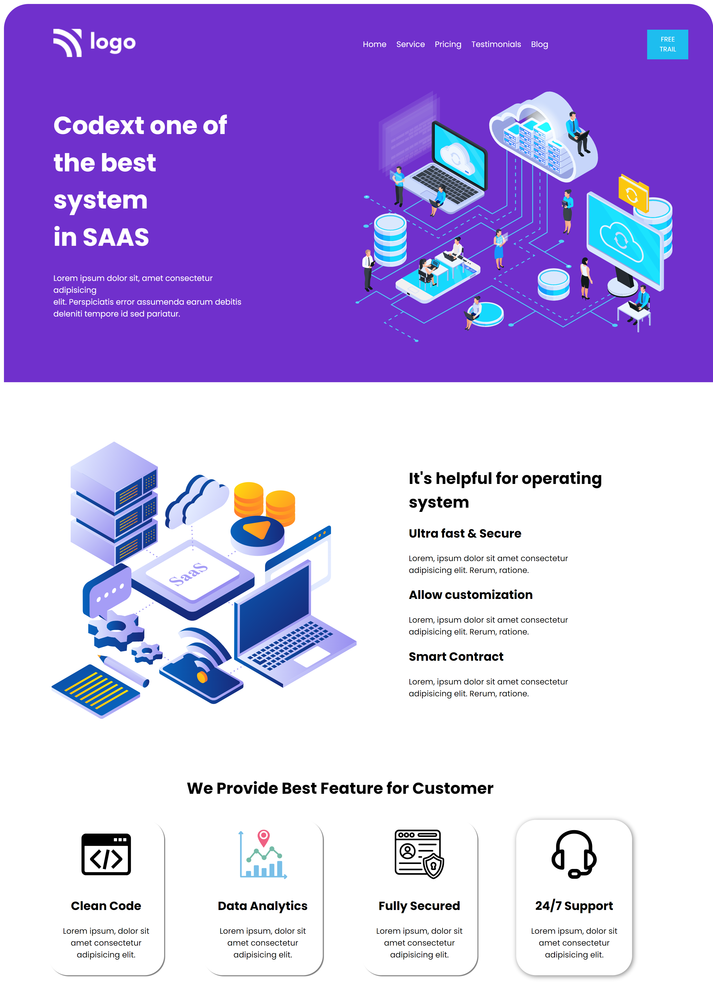
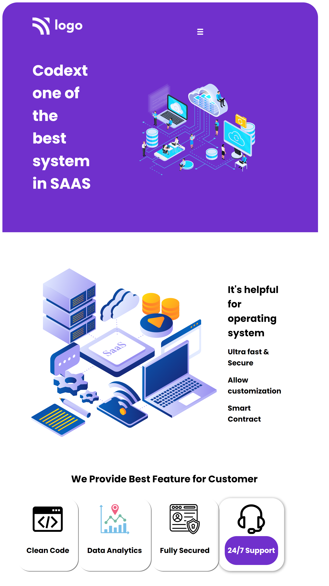

# Hi 👋 I am Devang 
 

## Project Name : **SAAS Landing Page !**

This project helped me in learning that minimal design can be beautiful too. The two hero section with different backgorund colors can look elegent too.

 

​

# 💻 Tech Stack Used :

​
  

 
​

## 📝 Features

- Responsive for screen size below 600px

- Hosted on Netlify

 

😌 Honest Time to finish the project

     It took me about 6 hrs

 

### You can Check it Live on Below Link :

[Live Link !]()

 

##  Final Output

 

##  Final Output for screen width below 600px

​

